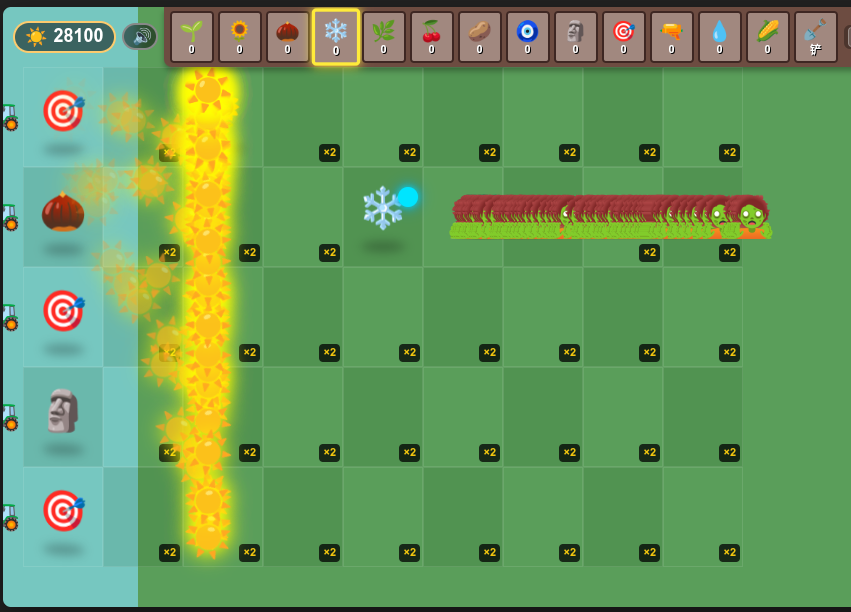
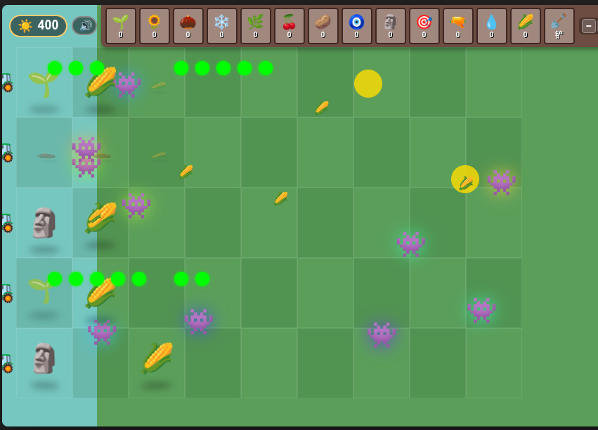
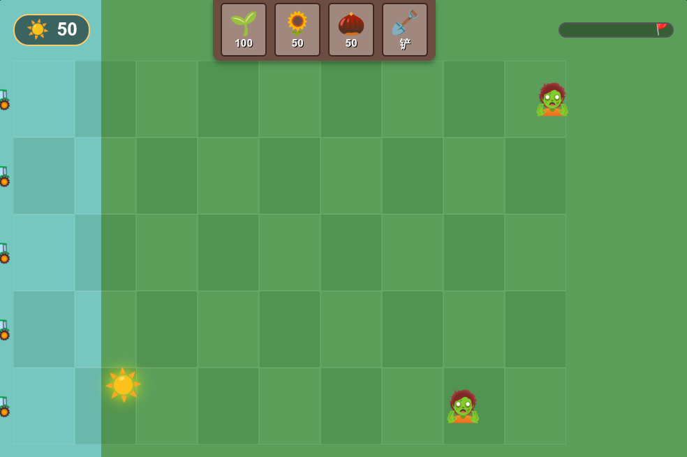
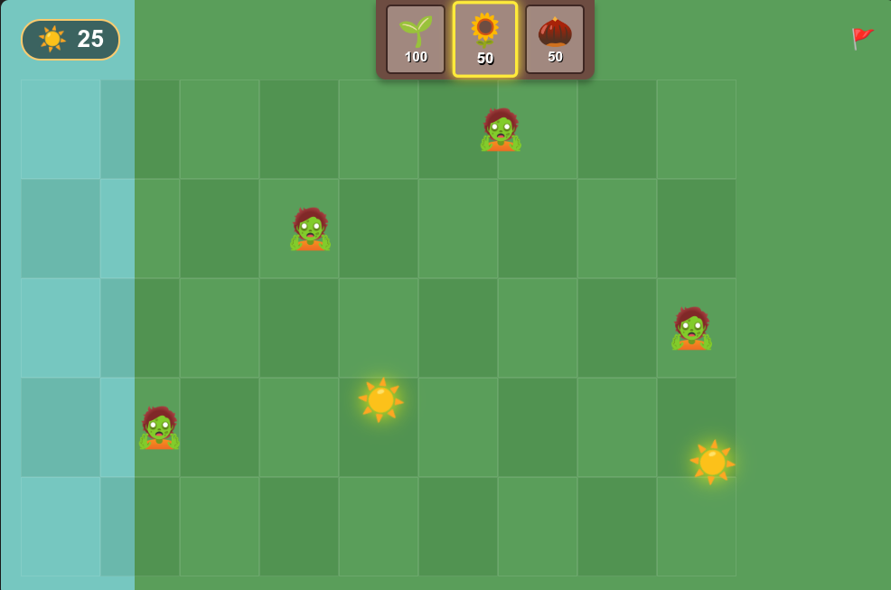

# Changelog

## v3.2 - 卷心菜投手与磁力菇（2026-08-07）

### 新植物
- 新增卷心菜投手 🥬（cabbagepult）：每 0.8 秒向同行投出一颗卷心菜，造成 40 点伤害
- 卷心菜投手 🥬 + 绿叶素：向场上每一个僵尸（含游荡者）各抛出一颗巨大卷心菜，
  抛物线从高空越过坚果墙 / 其他僵尸等障碍物，落点绕过报纸与铁门护盾判定，
  直接造成「无数点」伤害；场上无僵尸时给出提示而不是静默无反应
- 卷心菜子弹外观：绿色渐变球体 + 反向旋转动画；大招卷心菜边飞边旋转，落地绿色溅射
- 新增磁力菇 🧲（magnetshroom）：两段式磁场，先斥后吸。普通攻击每 1.5 秒打出一次
  斥力脉冲，把场上所有僵尸（含游荡者）往右轰 80px，再持续把它们纵向吸到自己
  所在的这一行，把整片草坪的进攻压缩成一条线
- 磁力菇 🧲 + 绿叶素：先把全场僵尸一口气击退 280px，再用 0.5 秒吸成一条直线，
  最后引爆磁场 —— 先扒掉路障 / 铁桶 / 铁门 / 报纸等金属护甲，再对每个僵尸造成
  17000 点伤害（正好是本作僵尸满血），游荡者被轰回右侧重新爬
- 磁力菇外观：紫色脉动光晕，斥力脉冲有向外扩散的紫环，被吸僵尸带紫色描边，
  大招目标行整条亮起磁场与冲击波

- 新增超级机枪 🪖（supermg）：戴钢盔的豌豆，每 0.5 秒泼出 6 颗豌豆、每颗 20 点伤害；
  每打满 5 轮（约 2.5 秒）自动开一次大招，向前扇形喷出 150 颗散射豌豆，每颗同样 20 伤。
  这个大招是自动触发的，和绿叶素无关
- Projectile 新增 mgpea / scatterpea 两种弹道，并支持 `vy` 纵向速度（散射用，飞出上下边界即回收）
- spawnProjectile 现在返回创建出的弹体，省掉「取 game.projectiles 末位」的写法

### 波次
- 普通模式 9 波全部改为只刷报纸僵尸 📰：每只挡一次伤害，报纸被打掉后 ×2.5 狂暴加速。
  每波总数与出怪间隔沿用原混合波配置（500 / 1100 / 1500 / 2000 / 2100 / 3300 / 3900 / 4700 / 7800）
- 报纸僵尸此前在 9 波配置里一次都没出现过，代码写好了却从未刷出来
- 其余僵尸类型（普通 / 路障 / 铁桶 / 门板 / 撑杆）行为保留在 Zombie.js，只是不再进波次表；
  游荡者模式走 WandererSystem，不受影响

### 性能
- 修复满屏僵尸时卡到几乎不动：`Plant.takeDamage` 每次被啃都用
  `void offsetWidth` 强制同步布局来重启受击动画，上百只僵尸同时开啃时
  每帧要刷上百次全页布局。实测 287 僵尸 + 满屏叠种下 update 从 544ms/帧
  降到 8.4ms/帧（其中 takeDamage 533ms → 0.4ms）。改为动画正在播时不重启，
  顺带让 plantHit 能完整播完（原来每 16ms 重启，永远播不过 20%）
- 新增同时存活子弹上限 700（`CombatManager.MAX_PROJECTILES`）：帧率一低，
  子弹（每帧走固定像素）就活得更久、越攒越多、越攒越卡，形成正反馈。
  封顶后实测帧率从「8.5 → 4.0 持续下滑」变为稳定在 ~10；正常玩法碰不到这个上限
- spawnProjectile 触顶时返回 null，取返回值的调用方（超级机枪散射、坚果保龄）已判空

## v3.0 - 植物绝技与时间操控（2026-05-03 ~ 2026-05-04）

### 新植物
- 新增原始豌豆 🌟（primitivepea）：70 伤害豌豆，命中眩晕僵尸 2 秒并击退 80px
- 新增三重豌豆射手 🌳（triplepea）：同时向上中下三行各射一颗豌豆
- 新增坚果保龄球 🥥（nutbowling）：放下约 2 秒后沿当前行高速滚动，碾碎沿途所有僵尸
- 新增绿叶素 💚（plantfood）：选中后点向任意植物，触发 2 秒大招（攻速 ×20）

### 绿叶素特殊效果
- 普通发射型植物：进入大招期间无视僵尸检测疯狂开火，timer 累积速度 ×20
- 樱桃 🍒 + 绿叶素：满地 5×9 随机生成 13 种植物
- 土豆 🥔 + 绿叶素：满地铺樱桃，下一帧连锁爆炸
- 坚果保龄球 🥥 + 绿叶素：保龄球滚过每一格自动种下随机土豆 / 樱桃

### 时间操控（敌人加减速）
- 新增 G 键：全场僵尸 ×3 加速（含游荡者，可叠加）
- 新增 H 键：全场僵尸 ÷3 减速（含游荡者，可叠加）

### 平衡与机制调整
- 所有僵尸血量统一从 99999 调整为 17000（仍远高于原版）
- 樱桃炸弹改为约 0.8 秒后引爆（之前是种下立即爆炸）
- 寒冰子弹减速从 50% 改为每次命中 30%（可叠加）
- WaveManager 改用按权重随机选僵尸类型，移除大 pool 数组
- 移除各波次中报纸僵尸出场，替换为路障 / 撑杆

### 无限割草机
- 割草机划出屏幕后自动重置位置复用，不再消失
- triggerLawnmower 找不到可用割草机时即时新建一台，不再判负
- 一行可以无限触发割草机

### UI 改进
- 顶栏由 60px 加高至 120px，腾出空间
- 进度条下方新增波次统计标签：当前波 / 剩余 / 场上僵尸数
- 漫游模式下显示场上僵尸数；全部完成后显示完成提示
- 大招植物添加绿色光晕 + 缩放脉动动画

### 视觉
- 新增坚果保龄球椰子球外观（径向渐变 + 旋转滚动动画）
- 新增原始豌豆金色光球外观

### 工程
- 拼音变量名统一改为英文：yuanshiwandou → primitivepea，sanchongwandousheshou → triplepea，jianguobaolingqiu → nutbowling，lvyesu → plantfood
- 同步重新构建 docs/ 下的 GitHub Pages 部署产物
- 修订首页玩法说明，与代码当前行为对齐（成本、减速比例、引爆时间、绝技效果等）

---

## v2.0 - 天马行空大爆发（2026-05-01 ~ 2026-05-02）

### 新植物
- 新增寒冰射手 ❄️：子弹命中减速僵尸，可完全冻结游荡者
- 新增双重射手 🌿：同时发射两颗豌豆
- 新增樱桃炸弹 🍒：种下即爆，清除 3×3 范围内所有僵尸
- 新增土豆地雷 🥔：延迟触发，僵尸踩上即秒杀
- 新增投手 🎯：发射穿透型子弹，贯穿整行僵尸
- 新增黏液菇 🧿：子弹命中显著减慢僵尸移速
- 新增黑曜石 🗿：近战超高伤害
- 新增加特林豌豆 🔫：极高射速连射
- 新增水滴射手 💧：水滴子弹
- 新增玉米加农炮 🌽：手动点击瞄准，对目标无限连发；可同时锁定多个目标；暂停时点击僵尸，恢复后延迟爆炸

### 新僵尸
- 新增报纸僵尸：报纸被打掉后暴走加速
- 新增撑杆跳僵尸：跳过第一株植物
- 新增门板僵尸：持门板当盾，超高护甲
- 所有僵尸血量统一调整为 99999

### 游荡者模式
- 全新游荡者模式：10 只 👾 游荡者在场上永久游荡，血量无限大，永远无法被消灭
- 游荡者经过植物格子会造成伤害
- 坚果墙可阻挡游荡者前进（不影响普通僵尸）
- 寒冰子弹可完全冻结游荡者移动
- 游荡者使用 typed array + canvas 独立渲染，支持大量实体

### 融合模式
- 同格反复点击同类植物可升级融合，伤害/射速按融合等级叠加

### 叠种机制
- 同一格可无限叠种，格子显示 ×N 徽章
- 单次种植数量可在 HUD 调整（最高 1,000,000）
- 叠种越多，栈顶植物射速越快

### 操作与快捷键
- 空格键：暂停 / 继续
- `F` 键：植物全体加速 ×3，可无限叠加（×9、×27、×81……）
- `Esc`：取消选植物 / 退出加农炮瞄准模式
- 铲子一次铲除该格所有叠种植物

### 游戏设置
- 新增僵尸速度滑块（很慢 → 噩梦）
- 新增僵尸数量倍率（×0.1 ~ ×10）
- 新增全屏随机子弹开关：开启后每帧在全场随机生成各类子弹
- 阳光、波数、僵尸量均可在开始前配置

### 工程重构
- 代码按功能拆分为 7 个独立模块：`Constants` / `WandererSystem` / `WaveManager` / `UIEvents` / `CombatManager` / `SunManager` / `PlantManager`
- `app.js` 从 1103 行精简至 382 行，Game 类只保留核心生命周期与主循环

---

## v0.3 - 说明与启动（2026-02-09）

- 在开始界面添加「怎么玩」玩法说明
- 添加 `start.sh` 启动脚本

## v0.2 - 核心玩法完善（2026-02-09）

- 修复植物射击/产出阳光改为基于 deltaTime，不同刷新率行为一致
- 实现 6 波关卡系统，含进度条显示
- 新增路障僵尸 (200 HP) 和铁桶僵尸 (400 HP)
- 添加割草机防线，每行一个，僵尸突破时自动清场
- 添加铲子工具，可移除已种植的植物
- 添加种子卡冷却系统及视觉遮罩
- 添加胜利画面（击退全部 6 波后触发）
- 添加「阳光不足」/「冷却中」提示
- 坚果墙增强至 400 HP，含 3 阶段受损外观
- 限制 deltaTime 防止切换标签页后时间跳跃

## v0.1 - 初始版本（2026-02-09）

- 基础游戏框架：HTML5 + CSS + 原生 JS
- 9x5 网格草坪
- 3 种植物：豌豆射手、向日葵、坚果墙
- 普通僵尸生成
- 阳光掉落与收集机制
- 豌豆子弹碰撞检测
- 开始/游戏结束界面
