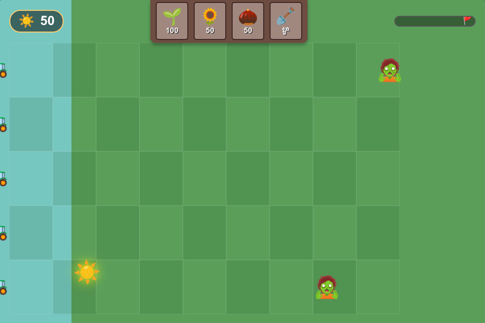

# 植物大战僵尸 Web 版

一个基于 HTML5 + CSS + 原生 JavaScript 的植物大战僵尸网页游戏。



## 快速开始

```bash
./start.sh        # 默认端口 1644
./start.sh 3000   # 自定义端口
```

然后浏览器打开 `http://localhost:1644`。

## 玩法

- ☀️ 点击收集掉落的**阳光**，阳光是种植植物的货币
- 🌱 点击上方**种子卡**选择植物，再点击草坪格子种下
- 🪏 点击**铲子**可以移除已种植的植物
- 🧟 击退全部 **6 波僵尸**即可获胜

### 植物

| 植物 | 费用 | 说明 |
|------|------|------|
| 🌻 向日葵 | 50 | 每 10 秒产出额外阳光 |
| 🌱 豌豆射手 | 100 | 向同行僵尸发射豌豆 |
| 🌰 坚果墙 | 50 | 400 HP，挡住僵尸前进 |

### 僵尸

| 僵尸 | 血量 | 特点 |
|------|------|------|
| 🧟 普通僵尸 | 100 | 标准速度 |
| 🔶🧟 路障僵尸 | 200 | 标准速度，更耐打 |
| 🪣🧟 铁桶僵尸 | 400 | 稍慢，非常耐打 |

### 其他机制

- 🚜 **割草机** — 每行一个，僵尸突破时自动清场（仅一次）
- ⏱️ **冷却系统** — 种植后需等待冷却才能再次种植同类植物
- 📊 **进度条** — 显示当前波次进度

## 项目结构

```
├── index.html          # 游戏入口
├── app.js              # 主游戏引擎（波次、阳光、割草机等）
├── style.css           # 样式
├── classes/
│   ├── Entity.js       # 实体基类
│   ├── Plant.js        # 植物类
│   ├── Zombie.js       # 僵尸类
│   └── Projectile.js   # 子弹类
└── start.sh            # 启动脚本
```

## License

MIT
