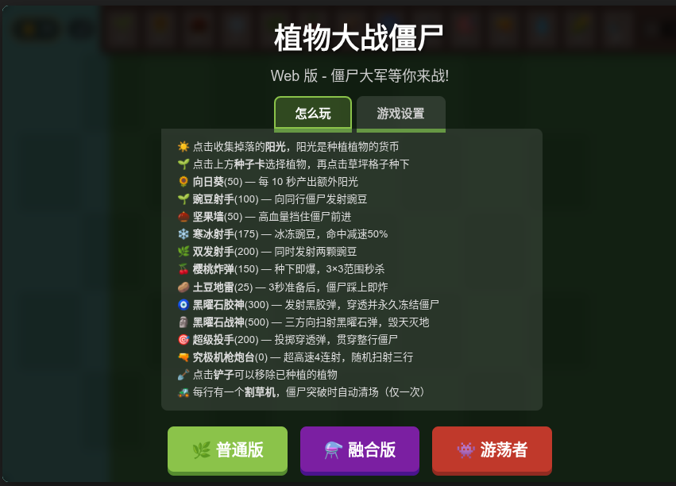

# 植物大战僵尸超级无敌版

> 这个游戏的所有创意来自一个 9 岁小男孩天马行空的想法。他不想要"平衡"，他想要爽。




## 这个游戏哪里不正常

这里列出的每一条，都是他的原话需求：

**植物可以无限叠种。** 同一个格子可以种 100 万株植物。叠得越多，植物射击越快。格子上会显示 ×N 的徽章。

**F 键可以无限叠加加速。** 每按一次 F，所有植物的射速乘以 3。按三次就是 ×27 倍速，按十次是 ×59049 倍速。没有上限。

**有一种敌人永远打不死。** 游荡者模式里的 👾 游荡者血量是无穷大，任何子弹都只会让它重生在右边。它们在场上漫无目的地乱窜，碰到哪格植物就伤害哪格。坚果墙可以挡住它们，但不能消灭它们。

**玉米加农炮可以同时轰炸无数个目标，永不停歇。** 选中玉米加农炮后，点一只僵尸它就开始无限连发。继续点其他僵尸，炮台会同时对所有目标持续开火。只有按 Esc 才能停下来。

**暂停的时候也可以瞄准。** 游戏暂停后点击僵尸，等恢复运行时炮弹才会飞出去爆炸。

**有一个"全屏随机子弹"模式。** 开启后，每一帧都会在整个棋盘随机位置生成各种随机类型的子弹。没有任何植物在射击，子弹凭空出现。

**僵尸血量是 17000。** 不是 100，不是 400。是 17000。每一只。

**G 和 H 是给僵尸加速 / 减速的快捷键。** 按 G 全场僵尸 ×3 加速，按 H ÷3 减速，可无限叠加。F 是给植物加速的，G H 是给敌人加速的。三个键一起按可以构造任意荒诞速度比。

**割草机用不完。** 一行一台割草机被僵尸触发清场后，划出屏幕会自动复位重新装填；如果没有可用的，触发时会现场新建一台。永远不会因为"割草机用完了"而判负。

**绿叶素是核武器开关。** 选中绿叶素 💚 点向樱桃 → 满地 5×9 = 45 株随机植物。点向土豆 → 满地铺樱桃，下一帧全部连锁爆炸。点向坚果保龄球 → 保龄球滚过每一格自动种下土豆或樱桃。点向卷心菜投手 → 全场每个僵尸头上各挨一颗巨大卷心菜，从高空越过坚果墙和铁门砸下来，护甲一概无效。点向磁力菇 → 全场僵尸被吸成一条直线，金属护甲当场脱落，然后整行磁场引爆，一人 17000。

**胜利时会种 100 株随机植物庆祝。** 击退所有僵尸后，棋盘上会随机爆满 100 株植物。

**第一局自动赢。** 他要求第一局跳过战斗直接胜利，这样一开游戏就能看到撒花庆祝的画面。

---

## 快速开始

**在线游玩（GitHub Pages）：** https://baojie.github.io/PVZ/

本地运行：

```bash
./start.sh        # 默认端口 1644
./start.sh 3000   # 自定义端口
```

浏览器打开 `http://localhost:1644`。

---

## 游戏模式

| 模式 | 说明 |
|------|------|
| **普通模式** | 击退 N 波僵尸即可胜利 |
| **融合模式** | 同格点击同类植物可升级融合，属性叠加 |
| **游荡者模式** | 10 只永生的 👾 游荡者在场上乱窜，永远打不死 |

---

## 植物

| 植物 | emoji | 说明 |
|------|-------|------|
| 豌豆射手 | 🌱 | 向同行僵尸射击 |
| 向日葵 | 🌻 | 定期产出阳光 |
| 坚果墙 | 🌰 | 高血量肉盾；会挡住游荡者前进 |
| 寒冰射手 | ❄️ | 子弹命中可减速/冻结僵尸和游荡者 |
| 双重射手 | 🌿 | 同时发射两颗豌豆 |
| 樱桃炸弹 | 🍒 | 爆炸清除周围 3×3 格的僵尸 |
| 土豆地雷 | 🥔 | 触发一次大范围爆炸 |
| 投手 | 🎯 | 发射穿透型子弹 |
| 黏液菇 | 🧿 | 子弹命中会减慢僵尸速度 |
| 黑曜石 | 🗿 | 超高伤害的近战植物 |
| 加特林豌豆 | 🔫 | 快速连射 |
| 水滴射手 | 💧 | 发射水滴子弹 |
| 玉米加农炮 | 🌽 | 手动瞄准，对选中的僵尸无限连发 |
| 原始豌豆 | 🌟 | 70 伤害豌豆，命中眩晕 2 秒并击退僵尸 |
| 三重豌豆射手 | 🌳 | 同时向上中下三行各射一颗豌豆 |
| 坚果保龄球 | 🥥 | 放下约 2 秒后沿当前行高速滚动，碾碎沿途所有僵尸 |
| 卷心菜投手 | 🥬 | 每 0.8 秒向同行投出一颗卷心菜，造成 40 点伤害 |
| 磁力菇 | 🧲 | 每 1.5 秒把全场僵尸往右击退 80px，再纵向吸到自己所在的这一行 |
| 超级机枪 | 🪖 | 戴钢盔的豌豆。每 0.5 秒 6 连发（每颗 20 伤），每打满 5 轮自动喷 150 颗散射豌豆；每吃一次绿叶素，这株的连发数永久 +1 |
| 绿叶素 | 💚 | 选中后点向任意植物，触发 2 秒大招（攻速 ×20）；对樱桃 / 土豆 / 坚果保龄球 / 卷心菜投手 / 磁力菇触发特殊全屏效果 |

**叠种**：同一格可以种多株植物，显示 ×N 徽章，栈顶植物获得速率加成。

**绿叶素特效**：
- 普通植物 → 攻速 ×20，无视僵尸检测疯狂开火
- 🍒 樱桃 → 满地随机生成 13 种植物
- 🥔 土豆 → 满地铺樱桃（再连锁触发爆炸）
- 🥥 坚果保龄球 → 保龄球滚过每一格自动种下随机土豆 / 樱桃
- 🥬 卷心菜投手 → 向全场每一个僵尸各抛一颗巨大卷心菜，走抛物线越过所有障碍物，无视护甲直接砸头
- 🪖 超级机枪 → 这株的连发数永久 +1（6 → 7 → 8 …），喂几次涨几次，植物上有「N 连」徽章
- 🧲 磁力菇 → 先把全场僵尸远距离击退 280px，再吸成一条直线，扒掉金属护甲后引爆磁场，每个僵尸吃满 17000 点伤害

---

## 僵尸

**普通模式全场只刷报纸僵尸。** 每一波、每一只，都是 📰。挡一次伤害，报纸被打掉后 ×2.5 狂暴加速冲过来。

| 僵尸 | 特点 |
|------|------|
| 📰🧟 报纸僵尸 | 普通模式唯一出场的僵尸。报纸挡一次伤害，被打掉后暴走加速 |
| 👾 游荡者 | 永生，四处乱窜，伤害所经过格子的植物（仅游荡者模式） |

其余类型（普通 🧟 / 路障 🔶 / 铁桶 🪣 / 门板 🚪 / 撑杆 🏌️）的行为仍然完整保留在 `classes/Zombie.js` 里，只是波次表不再刷它们 —— 想换回混合波，改 `classes/WaveManager.js` 的 `allWaves` 即可。

---

## 操作

| 操作 | 效果 |
|------|------|
| 点击种子卡 → 点击格子 | 种植植物 |
| 点击 🪏 → 点击格子 | 铲除该格所有植物 |
| 点击 🌽 → 点击僵尸 | 玉米加农炮瞄准并无限连发 |
| `Space` | 暂停 / 继续 |
| `F` | 植物加速（可叠加，每按一次 ×3） |
| `G` | 全场僵尸加速 ×3（可叠加） |
| `H` | 全场僵尸减速 ÷3（可叠加） |
| `Esc` | 取消选择 / 退出瞄准模式 |

---

## 游戏设置

开始前可在设置面板调整：

- **初始阳光**：50 / 150 / 300 / 无限（当前所有植物均免费，阳光仅作展示）
- **总波数**：3 / 6 / 9 波
- **僵尸数量**：少 / 正常 / 多 / 超多（×0.5 ~ ×4）
- **僵尸速度**：滑块 ×0.5 ~ ×3
- **全屏随机子弹**：开启后每帧在全场随机生成子弹（默认关）

---

## 项目结构

```
├── index.html
├── app.js                  # Game 类：主循环、生命周期
├── style.css
├── start.sh
└── classes/
    ├── Constants.js        # 植物常量、emoji 光标
    ├── Entity.js           # 实体基类
    ├── Plant.js            # 植物行为
    ├── Zombie.js           # 僵尸行为
    ├── Projectile.js       # 子弹碰撞
    ├── SoundManager.js     # 音效
    ├── WandererSystem.js   # 游荡者（typed array + canvas）
    ├── WaveManager.js      # 波次生成与推进
    ├── UIEvents.js         # DOM 事件绑定
    ├── CombatManager.js    # 炮台、爆炸、子弹、敌人查询
    ├── SunManager.js       # 阳光生成与收集
    └── PlantManager.js     # 植物放置与格子显示
```

---

## License

MIT
